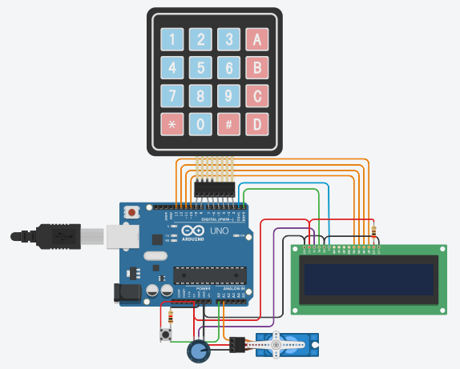
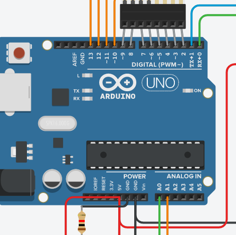
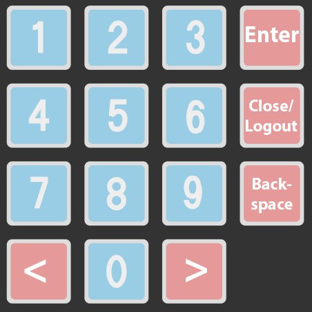

# Lock

An Electro-Mechanical Number Lock built for a NISER RoboTech Club Hackathon.

## Problem Statement

Design a Electro-Mechanical Number lock using whatever parts are available on [TinkerCad](tinkercad.com/circuits). The mechanical aspect you can just roughly state in your code comments. The machine needs to have the following features:

    1. Ability to hold multiple passwords for multiple users.
    2. It should be a stand alone machine, i.e. should not have to be
	   connected to computer to change password/ add new user password     etc.
    3. It should be resistant to power cut. First thing is, it shouldn't
	   loose saved passwords if power is cut, second- it should stay
	   locked if power is cut and restored, third try to wire up a backup
	   battery system.

Regarding the problem statement- if you want hint:

    1. Read about arduino EEPROM
    2. Read about how many bytes each datatype uses.
    3. You'll need to use "Linked List", "Classes"
	   for a efficient software for such a machine.

Deadline for Submission is 31 July 2021 11:59PM.

## Circuit Diagram

### This is how the circuit looks like.

### Closeup View of Arduino Connections:

### Normal Keypad:

### Changed Keypad:

## Device Instructions

1. Pressing **A** helps to enter into input mode for
	**USERNAME** and also acts as the **"ENTER"** key!
2. Presssing B helps it to lock if it is unlocked!
3. Username and password should be:\
   &emsp;minimum 4 character and\
   &emsp;maximum 9 characters long
4. Passwords and Usernames are all **numeric only**.
5. Maximum number of users supported = 50 (+1 admin)
6. Admin Username and Password both are "1234" initially.
	Password have to be changed on first Login.
7. Controls for giving input:\
	&emsp;&emsp;**numbers**	= > 	to type input\
	&emsp;&emsp;**'*'** 	= > 	to move cursor to the left\
	&emsp;&emsp;**'#'** 	= > 	to move cursor to the right\
	&emsp;&emsp;**'C'** 	= > 	to have a backspace
8. This device can be setup for two types of users:\
	&emsp;a. Home user:- every user is an admin user and can add or remove users\
	&emsp;b. Office Users:- Only the admin user can add or remove users

9. **Hidden Feature** for Sincere People who care to read this user guide:\
	(points 5 and 6 will be printed on the box for advertisement purpose)\
	&emsp;a. To change your password:\
		&emsp;&emsp;&emsp; When device is READY....\
		&emsp;&emsp;&emsp; Press these keys successively => *, #, C and B\
	~~&emsp;b. There was one more hidden feature, but I removed\
		&emsp;&emsp;&emsp; it in this commit, go to previous commits to see it!~~

## ** DON'T FORGET (Not for users, for developers) **
Actually this is for my own future references.

- EEPROM space [0] stores if admin password has been
changed or not. If no, value is 0, else value is 1.
If you see 0 at [0] remember to reset.

- EEPROM space [1023] stores current number of users (excluding admin)
- EEPROM space [1022] stores current mode of use:\
       &emsp;&emsp;mode 1     =>     for home use\
       &emsp;&emsp;mode 2     =>     for office use
	
- unused EEPROM space = [1021] which should be kept = ' '
- All the rest of the spaces are used in the following ways:\
		&emsp;=> starting from [1], consecutive 20 spaces are available for users\
		&emsp;=> the first 9 spaces for username, then a ' ' (space)\
		&emsp;=> next 9 spaces for password, then a ' ' again\
		&emsp;=> thus all the multiple of 10 places (Eg: [10], [20], [150], [1110])\
		&emsp;=> have values ' ' for propper functioning\
		&emsp;=> admin credentials are stored in [1:21] spaces\
		&emsp;=> all the other spaces are ' ' then\
		&emsp;=> first new user credentials are stored from [21] onwards, upto [40]\
	 	&emsp;=> next user comes in at [41] and the process goes on\
		&emsp;=> when an user is removed, its place gets overwritten by ' 's

- All the spaces except [0], [1022], [1023] are char type.
So, while reading them never try to read them in int.
To store them, only use char type variables
[0], [1022], and [1023] have to be read in int type vaiable!
